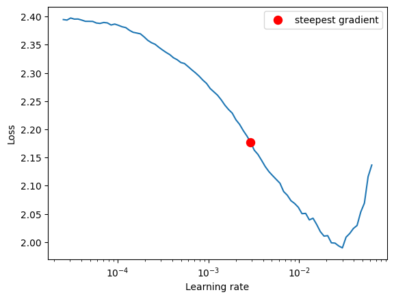
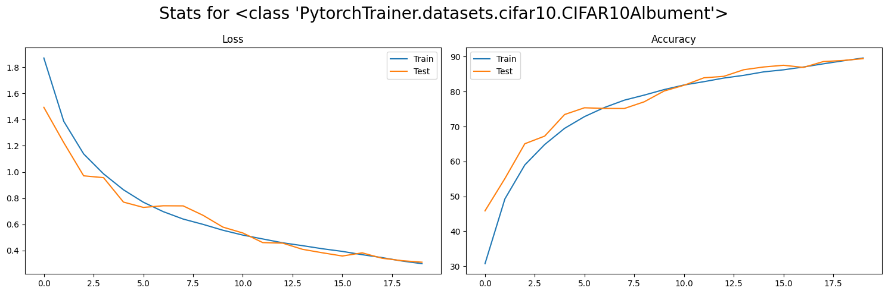
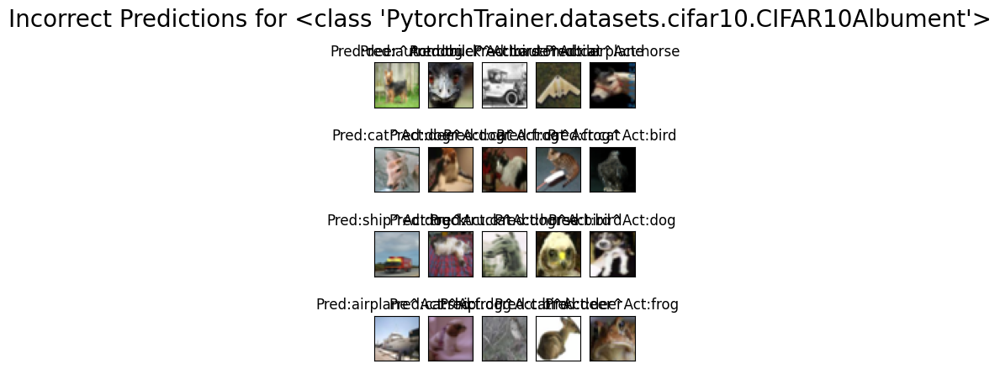
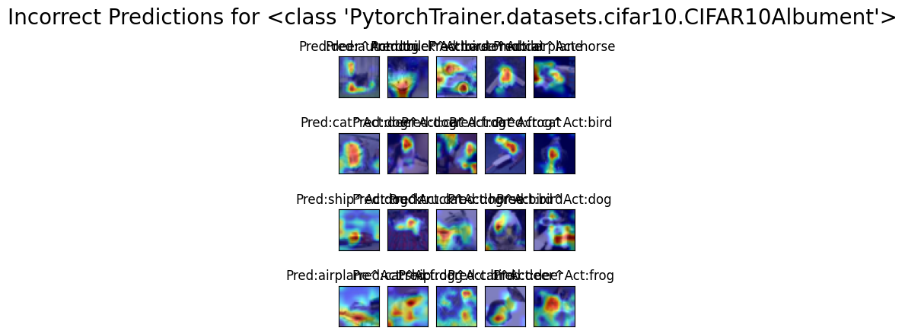

# ERA Session 11 Assignment

To solve this assignment, I have created a another repository named as [PytorchTrainer](https://github.com/ChikkaUdayaSai/PytorchTrainer). This repository contains all the code to train and test the model and only few lines of driver code is needed and the best thing is that we don't need to create any new function for training and testing.

## Example Usage

### Clone the repo
    
    ```bash
    git clone https://github.com/ChikkaUdayaSai/PytorchTrainer.git
    ```

### Install the requirements

    ```bash
    cd PytorchTrainer
    pip install -r requirements.txt
    ```

### Import the Trainer class

    ```python
    from PytorchTrainer.main import *

    cifar10, model = get_cifar10_dataset_and_resnet18_model()

    cifar10.display_examples()

    print_summary(model)

    experiment = create_resnet18_experiment(epochs=20, criterion='crossentropy', scheduler='one_cycle')

    experiment.execute()

    experiment.plot_stats()

    experiment.show_incorrect()

    experiment.show_incorrect(cams=True)
    ```

## Results

The experiment is created for 20 epochs with OneCycleLR scheduler. The learning rate Suggested as 2.92E-03 by steepest gradient. 



The best training accuracy is 89.63% and best validation accuracy is 89.44% at 20th epoch.

The loss and accuracy plots are shown below.


The incorrect predictions are shown below.


The incorrect predictions with GradCAM are shown below.
